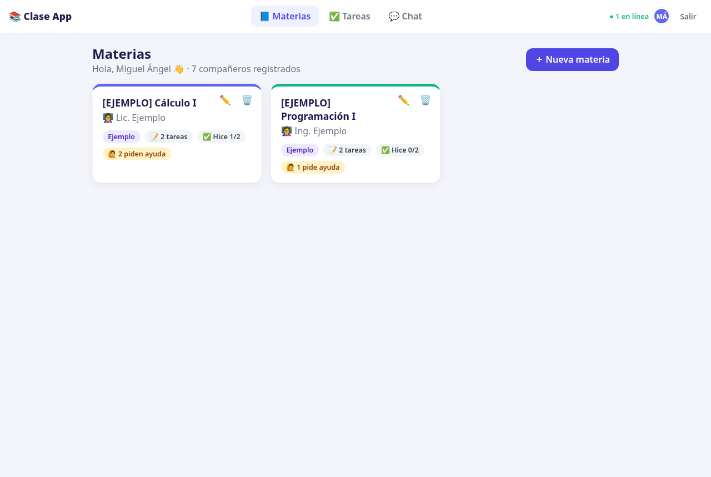
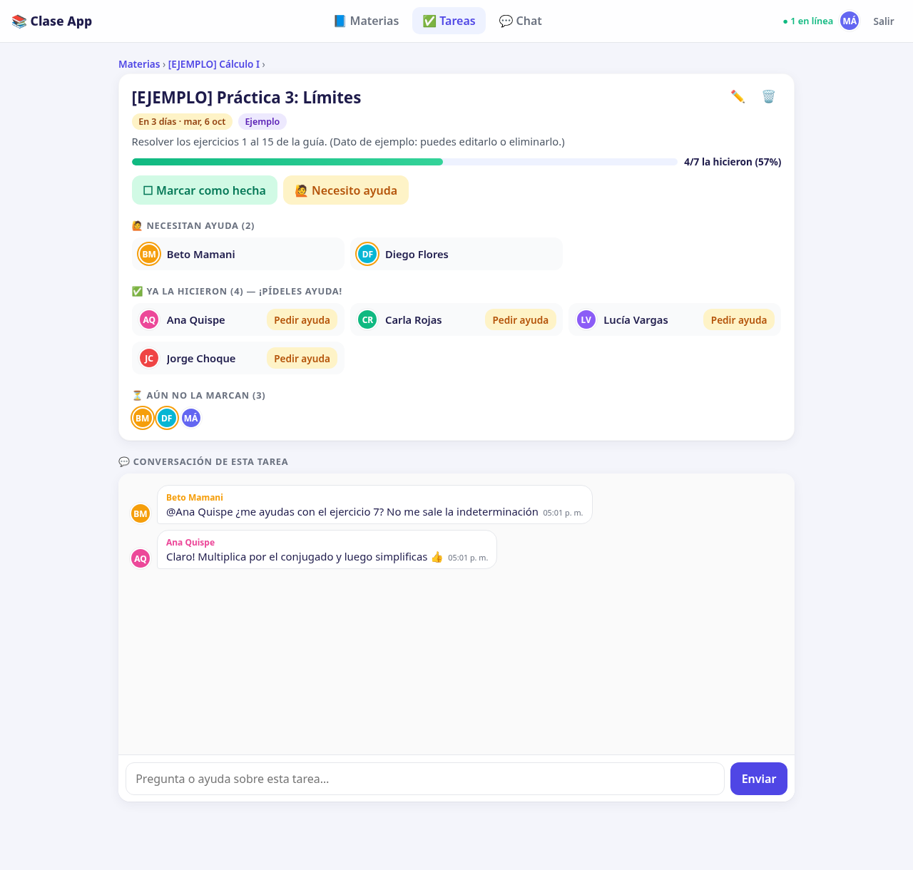
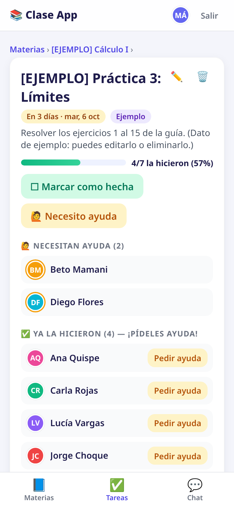

# 📚 Clase App — materias, tareas y chat de la clase

App web para un curso, pensada para que **cualquier grupo** la use a la vez:

- 🆕 **Crear una clase** con tu nombre y el nombre de la clase. La app genera un **código único** (6 letras o dígitos, fáciles de dictar) para compartirlo.
- 🔑 **Unirte a una clase** con ese código y tu nombre.
- 📘 Ver, crear, editar y eliminar **materias**.
- 📝 Ver, crear, editar y eliminar **tareas** de cada materia (título, descripción y fecha de entrega).
- ✅ Marcar si **hiciste la tarea**. En tu clase todos ven quién la hizo (avatares y progreso, por ejemplo `7/20 la hicieron`).
- 🙋 Marcar **"Necesito ayuda"** en una tarea. Así los demás lo ven y tú ves quién ya la hizo para pedirle ayuda (botón **"Pedir ayuda"**).
- 💬 **Chat general** de la clase en tiempo real, y un **chat por tarea** para dudas de esa tarea.
- ⚡ Todo se actualiza **en tiempo real** solo dentro de tu clase (Socket.io, una sala por clase).
- 📱 Diseño adaptado a celular (barra de navegación abajo).

> Es un **prototipo**: simple, sin cuentas externas. Cada clase está aislada: materias, tareas, marcas, usuarios y mensajes no se mezclan con los de otra clase. El mismo nombre en dos clases son dos personas distintas.

Una clase nueva **empieza vacía**. No hay materias de ejemplo: quien la crea ve una guía para agregar la primera.

## Capturas

| Materias | Detalle de tarea + chat | Celular |
|---|---|---|
|  |  |  |

Hay más capturas en la carpeta [`screenshots/`](screenshots/).

## Tecnologías

- **Node.js + Express** (servidor y API REST)
- **Socket.io** (tiempo real: marcas y chat, por clase). El tiempo real no pasa por Firestore: el servidor avisa a los que están conectados.
- **Firestore** (Firebase) cuando configuras la cuenta de servicio: los datos quedan en la nube y sobreviven a un redespliegue.
- **SQLite** con `better-sqlite3` si no hay credenciales de Firebase (tu compu y `npm test`).
- Frontend en **HTML + CSS + JavaScript puro** (`public/`), sin compilación

## Cómo correrlo en tu compu

Requisitos: [Node.js](https://nodejs.org) 18 o más nuevo (recomendado 20 LTS).

```bash
npm install
npm start
```

Abre **http://localhost:3000**.

### Crear una clase o unirte

En la pantalla de inicio hay dos pestañas:

- **Crear una clase:** tu nombre y el nombre de la clase (por ejemplo `Programación I · 2B`). Al crearla verás el código en grande, con botón para copiarlo o compartirlo. Entra y agrega la primera materia. El código también queda en la barra de arriba.
- **Unirme a una clase:** el código que te pasaron y tu nombre. No importan mayúsculas, minúsculas ni espacios.

Dentro de la app, **Cambiar** o **Salir** te devuelve a esa pantalla para entrar a otra clase. Quien creó la clase puede, en **Ajustes**, cambiarle el nombre o **generar un código nuevo** (el anterior deja de servir; quien ya entró sigue dentro).

Si ya entraste antes, usa el **mismo nombre** en esa clase para recuperar tus marcas.

### Variables de entorno

| Variable | Para qué sirve | Por defecto |
|---|---|---|
| `FIREBASE_PROJECT_ID` | Id del proyecto Firebase. Junto con una credencial, activa Firestore. | (apagado: se usa SQLite) |
| `FIREBASE_SERVICE_ACCOUNT` | JSON de la cuenta de servicio, en **una sola línea**. Es el secreto del servidor. | (vacío) |
| `GOOGLE_APPLICATION_CREDENTIALS` | Ruta al mismo JSON, si prefieres un archivo en vez de pegar el JSON. Sustituye a `FIREBASE_SERVICE_ACCOUNT`. | (vacío) |
| `PORT` | Puerto del servidor | `3000` |
| `DATA_DIR` | Carpeta de `clase.db` **solo en modo SQLite** | `./data` |
| `SEED` | Solo si vale `true` se crea una clase demo con datos de ejemplo. Las clases que cree la gente siguen vacías. | (apagado) |
| `CLASS_CODE` | Opcional. Código de la clase demo cuando `SEED=true`. En SQLite, si ya tenías una base vieja, es el código de esa migración. | `CLASE2026` al migrar SQLite; si no, se genera |
| `RATE_CREATE_MAX` | Máximo de clases nuevas por IP en la ventana | `10` |
| `RATE_JOIN_MAX` | Máximo de intentos de unirse por IP en la ventana | `60` |

Ver `.env.example`.

No hace falta definir un código global para publicar la app: cada grupo crea el suyo.

### Probar en la red del aula / casa

Si tu compu y los celulares están en el mismo WiFi, tus compañeros pueden entrar con `http://IP-DE-TU-COMPU:3000` (ej. `http://192.168.1.15:3000`).

## Clases vacías y datos de ejemplo

Por defecto **no** se crea ninguna clase demo ni materias de ejemplo. Cada clase nueva sale en blanco, con una pantalla que le indica a quien la creó cómo agregar la primera materia.

Si quieres una clase de demostración (por ejemplo para capturas), arranca una vez con `SEED=true`. Esa clase lleva el prefijo **`[EJEMPLO]`** y una etiqueta morada "Ejemplo". Puedes elegir su código con `CLASS_CODE`. Esas materias **no** se copian a las clases que cree la gente.

Si ya tenías `data/clase.db` de la versión de una sola clase, al arrancar se convierte en **una** clase. El código de entrada es `CLASS_CODE` si lo defines en ese primer arranque; si no, `CLASE2026`. Conviene fijar `CLASS_CODE` al código que usaban antes, antes de actualizar.

Para empezar de cero, detén el servidor y borra la carpeta `data/`.

## Guardar los datos en Firebase (Firestore)

Sin estas variables el servidor usa un archivo SQLite en el disco. En Render el disco gratis se borra al redesplegar, así que para que las clases sobrevivan hay que usar Firestore. El navegador **no** habla con Firebase: solo el servidor Node, con la cuenta de servicio. El chat y las marcas en vivo siguen yendo por Socket.io.

En Firestore cada clase es un documento `classes/{id}` con sus propias subcolecciones `materias`, `tareas`, `users`, `statuses` y `messages`. Así una clase no puede leer los datos de otra. Además hay tres colecciones de apoyo, también solo de servidor: `codigos` (el código de entrada apunta a una clase, y no se puede repetir), `sessions` (el token de quien ya entró) y `meta` (si ya se sembró la clase demo).

### 1. Crear el proyecto

1. Entra a [console.firebase.google.com](https://console.firebase.google.com) → **Agregar proyecto**. Ponle un nombre y crea el proyecto. Puedes desactivar Analytics.
2. En **Configuración del proyecto** (el engranaje) → **General**, copia el **ID del proyecto**. Ese valor es `FIREBASE_PROJECT_ID`.

### 2. Activar Firestore

1. En el menú, **Compilación → Firestore Database → Crear base de datos**.
2. Elige **modo nativo** (no Datastore).
3. Ubicación: la más cercana (por ejemplo `us-central1` o `southamerica-east1`).
4. Al empezar, el asistente puede dejarte en **modo de prueba**. No lo dejes así: en el paso 4 se cierra el acceso desde el navegador.

### 3. Crear la cuenta de servicio

1. **Configuración del proyecto → Cuentas de servicio**.
2. **Generar nueva clave privada** (Firebase Admin SDK). Se descarga un archivo `.json`.
3. **No lo subas a GitHub** ni lo pegues en el frontend. El `.gitignore` ya ignora `serviceAccount*.json`.
4. Para Render o Railway necesitas el contenido del archivo en **una sola línea**. En tu compu:

```bash
node -e "console.log(JSON.stringify(require('./serviceAccount.json')))"
```

Esa línea es el valor de `FIREBASE_SERVICE_ACCOUNT`.

En tu compu, si prefieres no pegar el JSON, puedes apuntar al archivo:

```bash
export GOOGLE_APPLICATION_CREDENTIALS="$PWD/serviceAccount.json"
export FIREBASE_PROJECT_ID="tu-id-de-proyecto"
npm start
```

Hace falta **una** de las dos formas de credencial, más el id del proyecto. Si el JSON ya trae `project_id`, el servidor lo usa cuando `FIREBASE_PROJECT_ID` no está definido.

### 4. Cerrar las reglas (nadie entra desde el navegador)

La cuenta de servicio **ignora** las reglas: el servidor sigue pudiendo leer y escribir. Las reglas solo frenan al SDK de cliente. En **Firestore → Reglas**, pega esto y pulsa **Publicar** (es el archivo `firestore.rules` del repo):

```
rules_version = '2';
service cloud.firestore {
  match /databases/{database}/documents {
    match /{document=**} {
      allow read, write: if false;
    }
  }
}
```

Si alguien abre la consola del navegador, no puede leer las clases ni los mensajes. Todo pasa por tu API.

### 5. Publicar el servidor Node

Sube el repo a GitHub (sin el JSON de la cuenta y sin `node_modules` ni `data/`).

#### Render (plan gratis)

1. [render.com](https://render.com) → **New +** → **Web Service** → conecta el repo.
2. **Runtime:** Node. **Build Command:** `npm install`. **Start Command:** `npm start`. **Instance type:** Free.
3. En **Environment** agrega:
   - `FIREBASE_PROJECT_ID` = el id del proyecto
   - `FIREBASE_SERVICE_ACCOUNT` = la línea JSON (secreto)
   - `SEED` = `false`
4. **Deploy**. La URL queda tipo `https://clase-app.onrender.com`. Ábrela y crea una clase: al recargar o redesplegar, la clase sigue en Firestore.

También puedes usar **New + → Blueprint** con `render.yaml`: te pedirá esas dos variables.

El plan gratis se duerme tras unos 15 minutos sin visitas; la primera carga puede tardar un minuto. Con Firestore los datos no se pierden al despertar.

#### Railway

1. [railway.app](https://railway.app) → **New Project** → **Deploy from GitHub repo**.
2. En **Variables** agrega `FIREBASE_PROJECT_ID` y `FIREBASE_SERVICE_ACCOUNT` (y `SEED=false` si quieres dejarlo explícito).
3. **Settings → Networking → Generate Domain**.

No hace falta un volumen: los datos están en Firestore. `PORT` lo pone la plataforma.

> Detrás de Render o Railway la app usa la IP real del visitante para el límite de intentos.

Comprueba el modo en `GET /api/salud`. Responde `{"ok":true,"almacen":"firestore"}` cuando las credenciales están bien, o `"almacen":"sqlite"` si faltan.

## Pruebas automáticas

```bash
npm test
```

`npm test` usa **SQLite** (borra las variables de Firebase a propósito) y no toca tu proyecto en la nube. Prueba: crear y unirse a una clase, códigos incorrectos, permisos, materias y tareas, **dos clientes Socket.io** de la misma clase, que **otra clase no ve** marcas ni chat, que una clase nueva nace vacía, la migración de una base antigua y los límites por IP.

Si tienes [Java](https://www.oracle.com/java/), puedes repetir el aislamiento contra el emulador local. La primera vez `npx` descarga la CLI de Firebase:

```bash
npm run test:firestore
```

Las capturas se generan con `scripts/screenshots.js` (necesita `puppeteer-core` y Google Chrome/Chromium; no está en las dependencias para que `npm install` siga siendo liviano). Ese script arranca con `SEED=true` para tener datos que fotografiar.

## Estructura

```
./
├── server.js          # Express + API REST + Socket.io
├── store/             # SQLite o Firestore, la misma API
├── db.js              # Esquema SQLite, migración y clase demo opcional
├── firestore.rules    # Niega todo acceso desde el navegador
├── public/
│   ├── index.html     # Página única
│   ├── styles.css     # Estilos (responsive)
│   └── app.js         # Lógica del frontend (rutas #/, #/materia/1, #/tarea/1, #/tareas, #/chat)
├── scripts/
│   ├── test.js        # Prueba de API + tiempo real + aislamiento
│   └── screenshots.js # Genera las capturas
├── screenshots/       # Capturas de pantalla
├── render.yaml        # Configuración para Render
└── .env.example
```

### API (resumen)

Todas las rutas (menos crear clase, unirse y salud) necesitan `Authorization: Bearer <token>`.

| Método | Ruta | Descripción |
|---|---|---|
| POST | `/api/clases` | `{nombre, clase}` → crea la clase y entra. `{token, usuario, clase}` |
| POST | `/api/login` | `{nombre, codigo}` → unirse. Código incorrecto: 401 |
| PUT | `/api/clase` | Quien creó la clase: `{nombre?, regenerar?}` |
| GET | `/api/materias` | Materias de **tu** clase, con contadores |
| POST/PUT/DELETE | `/api/materias[/:id]` | CRUD de materias (solo las de tu clase) |
| GET | `/api/materias/:id` | Materia con sus tareas |
| POST | `/api/materias/:id/tareas` | Nueva tarea |
| GET/PUT/DELETE | `/api/tareas/:id` | Ver/editar/eliminar tarea |
| PUT | `/api/tareas/:id/estado` | `{hecho?, ayuda?}` del usuario actual |
| GET | `/api/mensajes[?tarea=id]` | Chat general o de una tarea, de tu clase |

Eventos Socket.io (solo dentro de la sala de la clase): `chat:enviar` / `chat:nuevo`, `estado:cambio`, `datos:cambio`, `clase:cambio`, `presencia`, `escribiendo`.

## Limitaciones (es un prototipo)

- **Seguridad simple:** cualquiera con el código de la clase puede entrar con *cualquier* nombre, también el de otro compañero de **esa** clase, y cualquiera puede editar o borrar materias y tareas. Para una clase de confianza está bien; para algo más serio habría que agregar contraseñas por usuario y roles (por ejemplo, solo quien creó la clase borra).
- Hay un límite de creaciones de clase y de intentos de unión **por IP**, para frenar abusos. En un WiFi compartido (el aula) el de unirse es amplio a propósito.
- No hay notificaciones push al celular ni archivos adjuntos en el chat.
- El "total de estudiantes" del progreso (`x/20`) son las personas que entraron alguna vez **a esa clase**.
- Firestore aguanta mejor que un archivo SQLite cuando hay muchas clases a la vez. El tiempo real sigue en la memoria del servidor (Socket.io): si hay varias copias del servidor, un aviso no salta de una copia a otra.
- La clave de la cuenta de servicio es un secreto. Quien la tiene puede leer y escribir toda la base, porque el Admin SDK no obedece las reglas.
